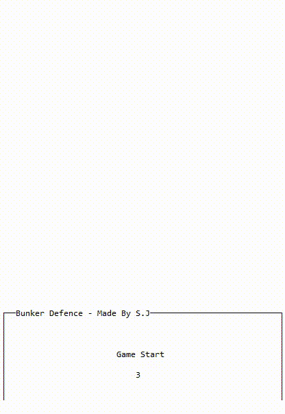

# 개인 프로젝트

Since 2018 ~ 2019

대학 생활 중 공부(재미) 목적으로 만들어본 개인 프로젝트 저장소입니다.

동영상 촬영을 해놓은 프로젝트만 게시하였습니다.

 
 

# List

- BunkerDefense
- RaiseFish
- Novelling
- CatDefense

 
 

# BunkerDefense

Java

생산/조합/강화/스팀팩 등을 통해 몰려오는 적을 막는 게임입니다.

평소 좋아하던 스타크래프트 유즈맵에 영감을 받았습니다.

멀티스레딩의 개념을 이해할 수 있었습니다.

 
 

# RaiseFish

Java(Swing)

물고기를 키우고 적을 무찌르며 어항을 키우는 게임입니다.

물고기키우기 게임에 영감을 받았습니다.

GUI 게임이 어떻게 돌아가는지 이해할 수 있었습니다.

 
 

# Novelling

PHP

소설을 올리고 공유하는 사이트입니다.

판타지 소설을 쓰던 시기에 만들게 되었습니다.

Server, REST API, Session, Cookie 등에 대해 이해할 수 있었습니다.

 
 

# CatDefense

Android(Java)

기지와 고양이들을 강화하고 상대를 무찌르는 게임입니다.

냥코대전쟁에 영감을 받았습니다.

Service, Broadcast Receiver, Room, SurfaceView 등의 개념을 이해할 수 있었습니다.

